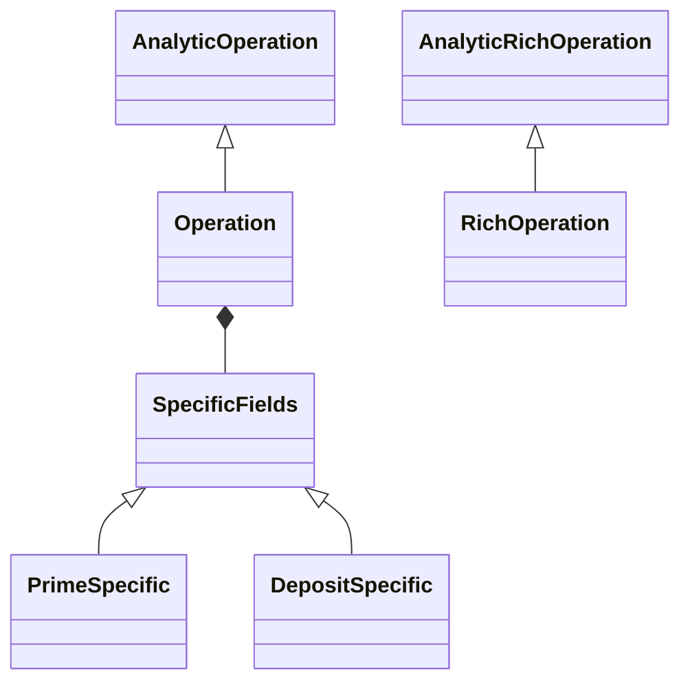

# Type-Safe Filters for Multi-Stage Operation Processing

This repository is an anonymised Scala 2 example based on a production refactoring of a banking operation-processing system.

The original legacy model was a flat structure with many optional fields. Several services filled this structure step by step with `copy`, while the same model was used both as an internal domain object and as a response for client applications.

The refactoring had three main goals:

1. introduce explicit domain models instead of one flat object with many unrelated optional fields;
2. build a type-safe and reusable filtering framework;
3. separate lightweight analytical processing from the full customer-facing enrichment flow.

The code in this repository focuses on the second and third goals and shows how Scala types, Shapeless and ZIO can be used to make invalid filter combinations fail at compile time.

## Main ideas

### Typed operation models

The model is split into several levels:

- `AnalyticOperation` contains only fields required for analytical calculations;
- `Operation` extends the analytical model with fields needed by the full domain flow;
- `AnalyticRichOperation` represents a lightweight enriched analytical operation;
- `RichOperation` is the full client-facing representation;
- `SpecificFields` is an ADT for fields that depend on an operation type.

This avoids a single flat model with many `Option` fields and makes the supported states more explicit.



### Filters are applied at the earliest possible stage

Operation processing has several stages:


A filter declares the earliest stage where it can be applied. For example:

- account filters can reject an account before operations are loaded;
- model filters run before enrichment;
- rich filters run only when enriched fields are required;
- complex filters can apply a cheap partial condition before enrichment and the full condition afterwards.

This reduces unnecessary work and calls to downstream systems.

### Filter compatibility is checked at compile time

Each filter type defines:

- the type of its value;
- the models it can work with;
- its predicate;
- optionally, its Tapir query input.

Type classes derive the correct filter appliers for a requested processing flow. Shapeless converts individual filters, tuples, nested tuples and filter case classes into a common `HList` representation.

Supported calls compile:

```scala
service.operations(
  AccountTypeFilter.empty -> BrandIds.empty
)

service.analyticOperations(
  AccountTypeFilter.empty -> AccountIds.empty
)

service.richOperations(
  OperationFilters.Empty -> CategoryIds.empty
)
```

Unsupported combinations do not compile:

```scala
// CategoryIds needs RichOperation fields.
service.operations(CategoryIds.empty)

// BrandIds is not available in the lightweight analytical model.
service.analyticOperations(BrandIds.empty)

// ComplexFilter needs both Operation and RichOperation stages.
service.operations(ComplexFilter.empty)
```

These guarantees are covered by compile-time tests using `shapeless.test.illTyped`.

## Filter stages

| Filter | Account | Analytical model | Full model | Analytical rich | Full rich | API input |
|---|:---:|:---:|:---:|:---:|:---:|:---:|
| `AccountIds` | ✓ | ✓ | ✓ | ✓ | ✓ | ✓ |
| `OperationIds` |  | ✓ | ✓ | ✓ | ✓ | ✓ |
| `AccountTypeFilter` | ✓ | ✓ | ✓ | ✓ | ✓ |  |
| `BrandIds` |  |  | ✓ |  | ✓ | ✓ |
| `CategoryIds` |  |  |  |  | ✓ | ✓ |
| `ComplexFilter` |  |  | partial |  | ✓ |  |

The table is expressed by the type hierarchy in `FilterType.scala`, not by a runtime configuration map.

## Composition

The caller can use a single filter, a tuple, a nested product or a case class:

```scala
service.richOperations(CategoryIds.empty)

service.richOperations(
  AccountTypeFilter.empty -> CategoryIds.empty
)

service.richOperations(
  OperationFilters.Empty ->
    (AccountTypeFilter.empty -> CategoryIds.empty)
)
```

This keeps the public API simple even though filter derivation is handled by type classes and Shapeless internally.

## Short-circuiting and observability

Filters inside an `HList` are evaluated from left to right and stop after the first negative result. The implementation uses ZIO effects, so metrics can be recorded without changing the filter API.

The sample includes the `filters_applied_total` counter with labels for:

- filter type;
- processing stage;
- result.

## Production result

In the production system that inspired this example, separating the analytical flow from the full enrichment pipeline:

- reduced RPC calls to some downstream systems by up to **2.5x**;
- reduced CPU usage from **52% to 45%** after the release.

The production implementation and internal service names are not included in this repository.

## Project structure

```text
src/main/scala/net/cheltsov/
├── model/                 # Analytical, domain and rich operation models
├── filters/
│   ├── Filter.scala       # Optional typed filter value
│   ├── FilterType.scala   # Filter capabilities and predicates
│   ├── FilterApplier.scala
│   ├── FiltersProduct.scala
│   └── FilterInput.scala  # Tapir input derivation
├── OperationsService.scala
└── Examples.scala

src/test/scala/net/cheltsov/
├── FilterSpec.scala
├── FilterApplierSpec.scala
├── FiltersProductSpec.scala
└── FilterCompileChecks.scala
```

See [TESTING.md](TESTING.md) for details about runtime and compile-time tests.

## Technology

- Scala 2
- ZIO
- ZIO Prelude
- Shapeless
- Tapir
- Enumeratum
- ZIO Test

## Repository scope

This is a focused architecture example rather than a complete application. External integrations, persistence and production infrastructure are intentionally omitted. Placeholder data-loading methods and the generic Tapir newtype codec still need a demo implementation before the repository can be run as a standalone project.
